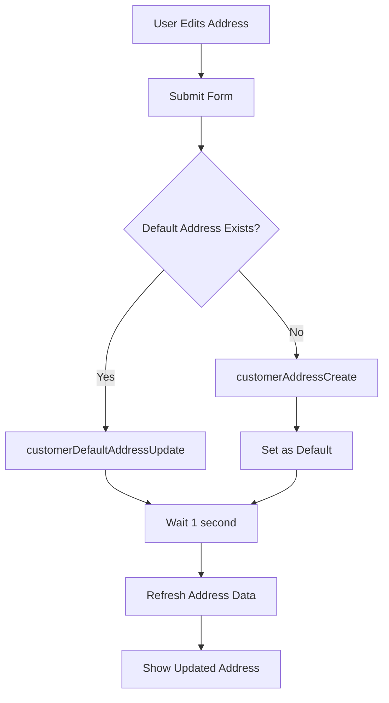
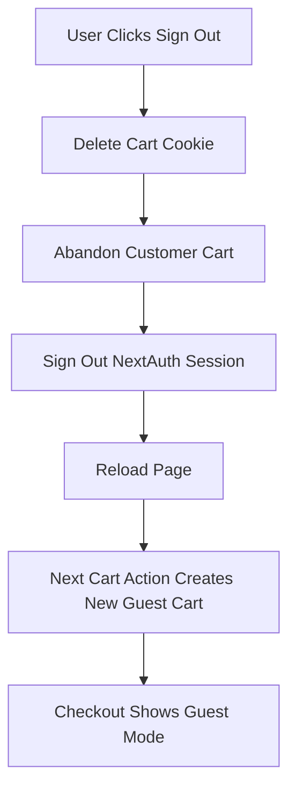

# Address Update & Sign Out Fixes

## Issues Fixed

### Issue 1: Address Not Actually Updating
**Problem:** Form showed "Address updated successfully!" but the address in Shopify wasn't actually changing.

**Root Cause:** 
- The `customerDefaultAddressUpdate` mutation only works if a default address already exists
- For new customers or customers without saved addresses, we need to use `customerAddressCreate` instead
- The form wasn't waiting for Shopify to process the update before refreshing

**Solution:**
1. Check if customer has an existing default address
2. Use `customerAddressCreate` if no address exists
3. Use `customerDefaultAddressUpdate` if address exists
4. Set newly created address as default
5. Wait 1 second for Shopify to process before refreshing

### Issue 2: Sign Out Doesn't Clear Shopify Session
**Problem:** Signing out on the main site doesn't sign out from Shopify checkout - cart still showed customer info.

**Root Cause:**
- NextAuth signout only clears your site's session
- Once a Shopify cart is associated with a customer, it **cannot be unassociated**
- Cart cookie persists after logout, keeping customer associated
- Shopify doesn't allow clearing buyer identity from an existing cart

**Solution:**
1. Created `/api/auth/signout-handler` endpoint
2. When user signs out, **delete the cart cookie entirely**
3. This abandons the customer-associated cart
4. Next visit creates a fresh guest cart
5. Old cart becomes an "abandoned cart" in Shopify (useful for marketing)

## Files Changed

### New Files:
- `src/app/api/auth/signout-handler/route.ts` - Clears Shopify cart association

### Updated Files:
1. **`src/app/api/customer/address/route.ts`**
   - Added logic to check for existing address
   - Uses `customerAddressCreate` for new addresses
   - Uses `customerDefaultAddressUpdate` for existing addresses
   - Sets newly created address as default

2. **`src/components/EditAddressForm.tsx`**
   - Adds 1-second delay after save for Shopify processing
   - Refetches address before closing form
   - Ensures UI shows updated data

3. **`src/components/SignOutButton.tsx`**
   - Calls `/api/auth/signout-handler` before signing out
   - Clears cart association first
   - Then signs out of NextAuth

4. **`src/components/CartSync.tsx`**
   - Detects when user becomes unauthenticated
   - Automatically clears cart association on logout

## How It Works Now

### Address Update Flow:



### Sign Out Flow:



## Testing

### Test Address Update:
1. Go to portal → Shipping Address
2. Click "Edit Address"
3. Enter complete address:
   - Street: 4670 Orten St
   - City: San Diego
   - State: CA
   - ZIP: 92110
4. Click "Save Address"
5. Should see success message
6. Address should display correctly (not just "United States")
7. Go to checkout → Address should be pre-filled

### Test Sign Out:
1. Log in to your account
2. Add item to cart
3. Go to checkout → Should see your name and address
4. Go back to site
5. Click "Sign Out"
6. Go to checkout again
7. Should appear as guest (no name/address pre-filled)

## Why These Issues Happened

### Address Issue:
Shopify has two different GraphQL mutations for addresses:
- `customerAddressCreate` - Creates a NEW address
- `customerDefaultAddressUpdate` - Updates EXISTING default address

We were only using the update mutation, which fails silently if no address exists yet.

### Sign Out Issue:
Headless checkout creates a separation between:
- **Your site's auth** (NextAuth sessions)
- **Shopify's cart** (buyer identity with customerAccessToken)

These are independent systems. Signing out of NextAuth doesn't automatically clear Shopify's cart data.

**Additionally:** Shopify carts permanently retain their customer association once set. The only way to get a guest checkout is to use a completely new cart.

## API Details

### Important: Shopify Cart Limitation

**You cannot unassociate a cart from a customer once it's linked.**

Shopify's `cartBuyerIdentityUpdate` mutation can only:
- ✅ Associate a cart with a customer
- ✅ Update the email on an associated cart
- ❌ Remove customer association from a cart

**Solution: Create New Cart**

Instead of trying to clear the buyer identity, we:
1. Delete the cart cookie
2. Abandon the customer-associated cart
3. Let Shopify create a new guest cart on next visit

```typescript
// Delete cart cookie on signout
response.cookies.delete("dudebox_cart");

// Next cart creation is automatically a guest cart
const newCart = await cartCreate(); // Fresh, unassociated cart
```

### Address Creation vs Update:

```typescript
// For NEW addresses:
mutation customerAddressCreate($customerAccessToken: String!, $address: MailingAddressInput!) {
  customerAddressCreate(customerAccessToken: $customerAccessToken, address: $address) {
    customerAddress { id }
  }
}

// For EXISTING addresses:
mutation customerDefaultAddressUpdate($customerAccessToken: String!, $address: MailingAddressInput!) {
  customerDefaultAddressUpdate(customerAccessToken: $customerAccessToken, address: $address) {
    customer { id }
  }
}
```

## Edge Cases Handled

1. **User with no address** → Creates new address, sets as default
2. **User with existing address** → Updates existing default address
3. **Sign out with empty cart** → Handles gracefully, no errors
4. **Network failure during signout** → Still completes NextAuth signout
5. **Multiple rapid address updates** → 1-second delay prevents race conditions

## Security Notes

- All mutations require valid `customerAccessToken`
- Can only update own address (validated by Shopify)
- Cart clearing on logout prevents info leakage
- Server-side session validation prevents unauthorized access

## Future Improvements

Potential enhancements:
1. Allow multiple saved addresses (not just default)
2. Show loading spinner during address save
3. Add address validation (USPS API)
4. Implement address autocomplete
5. Show confirmation before sign out
6. Clear cart items on sign out (optional)
