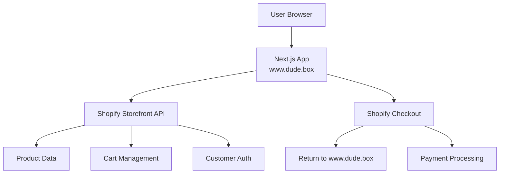

# Dude.Box Architecture Documentation

**Last Updated:** 2026-01-26 (Cleaned up after initial deployment)

## Architecture Overview

Dude.Box runs as a **headless commerce** application with Next.js 14 as the frontend and Shopify as the headless backend.

### High-Level Architecture



## Current State (As of Audit)

### Next.js Application (www.dude.box)

**Frontend Framework:**
- Next.js 14.0.4 with App Router
- React 18.2.0
- TypeScript 5.3.3
- TailwindCSS 3.3.3 for styling

**Authentication:**
- NextAuth 4.24.7 for session management
- Shopify Storefront API for customer authentication
- JWT-based sessions with customer access tokens

**Key Pages:**
- `/` - Homepage with mission and shop sections
- `/products/[handle]` - Product detail pages
- `/products/subscription-box` - Subscription product page
- `/portal` - Customer dashboard (requires auth)
- `/portal/login` - Customer login
- `/portal/register` - Customer registration
- `/portal/forgot-password` - Password recovery
- `/portal/reset-password` - Password reset
- `/investors` - Partner inquiry page
- `/gift` - Gift purchase page
- `/thank-you` - Post-checkout confirmation

### Shopify Integration

**API Usage:**
- Storefront API Version: `2024-07`
- Store Domain: `geuyxr-wz.myshopify.com`
- Storefront Access Token: Configured via environment variable

**Storefront API Queries/Mutations in Use:**

**Product Operations:**
- `products` query - List products (first 8, sorted by UPDATED_AT)
- `productByHandle` query - Single product by handle

**Cart Operations:**
- `cartCreate` mutation - Initialize new cart
- `cartLinesAdd` mutation - Add items to cart
- `cartLinesUpdate` mutation - Update line quantities
- `cartLinesRemove` mutation - Remove items from cart
- `cartBuyerIdentityUpdate` mutation - Associate customer with cart
- `cart` query - Fetch cart state
- `getCheckoutUrl` query - Get Shopify checkout URL

**Customer Operations:**
- `customerAccessTokenCreate` mutation - Customer login
- `customer` query - Fetch customer profile, addresses, orders

### Data Flow

**Product Browsing Flow:**
1. User visits homepage (www.dude.box) with embedded shop section
2. Server Component fetches products via Storefront API
3. Products cached for 300 seconds (5 minutes)
4. React renders product grid with custom UI
5. User clicks product → navigate to /products/[handle]
6. Server fetches product detail via Storefront API
7. User can add to cart (client-side)

**Cart Management Flow:**
1. Cart state stored in Shopify via Storefront API
2. Cart ID stored in httpOnly cookie (`dudebox_cart`)
3. All cart operations proxied through `/api/cart` route
4. Cart count synced to header via custom events
5. Cart drawer shows real-time cart state from Shopify

**Checkout Flow:**
1. User clicks "Checkout" in CartDrawer component
2. `/api/cart` route calls Storefront API `getCheckoutUrl`
3. Browser redirects to Shopify hosted checkout
4. Customer completes payment on Shopify
5. Shopify redirects to order status page (currently Shopify domain)
6. **TODO:** Configure return to www.dude.box

**Customer Authentication Flow:**
1. User submits login form at `/portal/login`
2. NextAuth CredentialsProvider calls Storefront API
3. Storefront API `customerAccessTokenCreate` returns access token
4. NextAuth stores token in JWT session
5. Customer data fetched via Storefront API `customer` query
6. Protected routes check session status

### File Structure

```
src/
├── app/
│   ├── layout.tsx                       # Root layout, includes header/footer
│   ├── page.tsx                         # Homepage with mission & shop sections
│   ├── globals.css                      # Global styles with CSS variables
│   ├── products/
│   │   ├── [handle]/page.tsx            # Dynamic product detail (SSR)
│   │   └── subscription-box/page.tsx    # Subscription product page
│   ├── portal/                          # Customer account pages
│   │   ├── layout.tsx
│   │   ├── page.tsx                     # Dashboard
│   │   ├── login/page.tsx
│   │   ├── register/page.tsx
│   │   ├── forgot-password/page.tsx
│   │   └── reset-password/page.tsx
│   ├── investors/page.tsx               # Partner inquiry page
│   ├── gift/page.tsx                    # Gift purchase page
│   ├── thank-you/page.tsx               # Post-checkout confirmation
│   └── api/
│       ├── cart/route.ts                # Cart operations proxy
│       ├── auth/
│       │   ├── [...nextauth]/route.ts   # NextAuth handler
│       │   ├── register/route.ts        # Customer registration
│       │   ├── recover/route.ts         # Password recovery
│       │   ├── reset-password/route.ts  # Password reset
│       │   └── signout-handler/route.ts # Clear cart on signout
│       ├── customer/
│       │   ├── address/route.ts         # Address management
│       │   └── update/route.ts          # Profile updates
│       └── investor-request/route.ts    # Partner inquiry form (TODO: wire to email)
│
├── components/
│   ├── SiteHeader.tsx                   # Global header with cart badge
│   ├── SiteFooter.tsx                   # Global footer
│   ├── CartDrawer.tsx                   # Slide-out cart UI
│   ├── CartSync.tsx                     # Sync cart with customer on login
│   ├── ProductAddToCartButton.tsx       # Reusable add-to-cart button
│   ├── ProductPurchaseOptions.tsx       # Variant selector + add to cart
│   ├── ShopProductCard.tsx              # Product card for listings
│   ├── EditProfileForm.tsx              # Customer profile editing
│   ├── EditAddressForm.tsx              # Address management
│   ├── LoginModal.tsx                   # Modal login/register form
│   ├── MemberLoginForm.tsx              # Portal login form
│   ├── SignOutButton.tsx                # Sign out functionality
│   ├── Providers.tsx                    # NextAuth SessionProvider
│   ├── Container.tsx                    # Layout container
│   ├── Section.tsx                      # Section layout component
│   └── Card.tsx                         # Card component
│
└── lib/
    ├── shopify.ts                       # Storefront API client & queries
    ├── auth.ts                          # NextAuth configuration
    ├── cart.ts                          # Cart utilities (future gift notes)
    └── constants.ts                     # Navigation links
```

### Legacy Theme Files (To Be Removed)

The following Liquid theme files exist in the repository but are **not actively used** for customer-facing pages:

- `layout/theme.liquid` - Contains redirect from shop.dude.box
- `sections/*.liquid` - 18 section files (header, footer, cart, product, etc.)
- `templates/customers/*.liquid` - Customer account templates
- `templates/*.liquid` - Product, cart, collection templates
- `assets/base.css.liquid` - Theme CSS
- `config/settings_schema.json` - Theme settings schema
- `config/settings_data.json` - Theme settings data

**Status:** These files should be archived and removed as part of Phase 3.

## API Surface Area

### Storefront API Endpoints

**Public (Unauthenticated):**
- Product catalog queries
- Cart mutations
- Checkout URL generation

**Authenticated:**
- Customer login/registration
- Customer profile queries
- Order history queries
- Address management

**Rate Limits:**
- Burst: 50 requests/second
- Sustained: 2000 requests/hour

### Caching Strategy

| Data Type | Location | Cache Strategy | Revalidate |
|-----------|----------|----------------|------------|
| Product List | Server Component | `revalidate: 300` | 5 minutes |
| Product Detail | Server Component | Dynamic (SSR) | Per request |
| Cart | API Route → Client | `cache: 'no-store'` | Never |
| Customer Data | API Route → Client | `cache: 'no-store'` | Never |

## Environment Variables

Required environment variables (from `.env`):

```
# Shopify Configuration
SHOPIFY_STORE_DOMAIN=geuyxr-wz.myshopify.com
SHOPIFY_STOREFRONT_ACCESS_TOKEN=[token]
SHOPIFY_REVALIDATION_SECRET=[secret]

# NextAuth
NEXTAUTH_SECRET=[secret]
NEXTAUTH_URL=https://www.dude.box

# Database (Neon PostgreSQL)
DATABASE_URL=[connection_string]

# Application
NEXT_PUBLIC_APP_DOMAIN=www.dude.box
NEXT_PUBLIC_APP_NAME=Dude.Box
```

## Ownership Boundaries

### Shopify Owns
- Product catalog (titles, descriptions, variants, inventory)
- Pricing and currency
- Cart state and checkout session
- Payment processing
- Order fulfillment
- Customer account data (email, addresses, passwords)

### Next.js Owns
- All UI/UX (header, footer, layouts, styling)
- Marketing pages and content
- Navigation and routing
- Session management (NextAuth)
- Analytics and tracking
- Form validation and UX

### Shopify Does NOT Own
- Customer-facing HTML/CSS
- Marketing copy
- Site navigation
- Custom portal features

## Recent Cleanup (2026-01-26)

**Files Removed:**
- Redundant page files with redirect conflicts (`/about`, `/our-mission`, `/shop`)
- Duplicate subscription pages (kept `/products/subscription-box`)
- Internal documentation page (`/the-concept`)
- Placeholder admin page (`/portal/admin`)
- Unused API route (`/api/member-interest`)

**Code Improvements:**
- Refactored `ShopProductCard` to use reusable `ProductAddToCartButton` component
- Removed duplicate add-to-cart logic
- Cleaned unused exports from `constants.ts`
- Added documentation for future gift note functionality in `cart.ts`
- Fixed Tailwind config (removed unused pages path and plugins)

## Known Issues & TODOs

### Outstanding Items

1. **Partner Form:** `/api/investor-request` needs email/CRM integration
2. **Checkout Return URL:** Configure to return to www.dude.box after purchase
3. **Customer Account URLs:** Configure Shopify password reset emails to point to Next.js
4. **API Optimization:** No webhooks for product updates (manual revalidation only)
5. **Error Handling:** Add error boundaries for Storefront API failures
6. **Gift Notes:** Implement cart attributes functionality (code scaffolded in `cart.ts`)

### Recommended Next Steps

See full deployment guide in `DEPLOYMENT_GUIDE.md` for configuration details.

## Performance Considerations

**Current Optimizations:**
- Product list cached for 5 minutes
- Images lazy loaded
- Next.js automatic code splitting
- Server-side rendering for SEO

**Future Optimizations:**
- Implement ISR with webhook revalidation for products
- Add error boundaries for Storefront API failures
- Implement GraphQL fragments to reduce query duplication
- Add request deduplication for parallel queries

## Security

**Current Security Measures:**
- httpOnly cookies for cart ID
- JWT sessions for customer authentication
- Storefront API token (public, scoped permissions)
- HTTPS enforced via Vercel

**Not Exposed to Client:**
- Admin API tokens (none in use)
- Database credentials
- NextAuth secret
- Revalidation secret

## Deployment

**Platform:** Vercel
**Domain:** www.dude.box
**Build Command:** `npm run build`
**Node Version:** 20.x

**Deployment Flow:**
1. Push to main branch
2. Vercel builds Next.js app
3. Environment variables injected
4. Deploy to production
5. Previous deployment retained (instant rollback available)

---

**Document Version:** 1.0.0
**Next Review:** After Phase 2 completion
