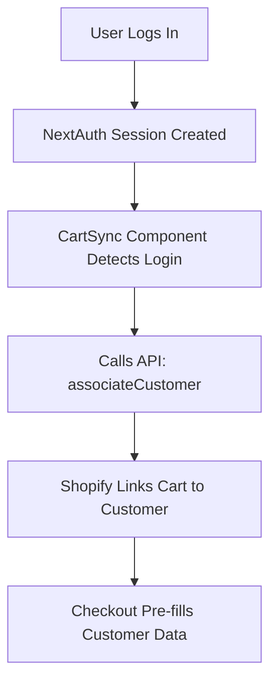

# Headless Checkout Authentication Fix

## The Problem

When using a headless Shopify setup (Next.js frontend + Shopify checkout), there are **two separate sessions**:

1. **Your Site Session** (NextAuth) - Managed by Next.js on your domain
2. **Shopify Checkout Session** - Managed by Shopify on their checkout domain

### What Was Happening:

```
User logs into your site → NextAuth creates session
User adds to cart → Cart is created
User goes to checkout → Shopify doesn't know who they are!
```

The cart and customer weren't connected, so:
- Shopify checkout showed incomplete/wrong address
- User appeared logged out at checkout
- Saved addresses weren't loaded

## The Solution

We now **proactively associate the customer with their cart** as soon as they log in.

### How It Works:



### Files Changed:

1. **`src/components/CartSync.tsx`** (NEW)
   - Runs on every page load
   - Detects when user is authenticated
   - Automatically associates customer with cart
   - Only runs once per session

2. **`src/components/LoginModal.tsx`**
   - Triggers `user:login` event after successful login
   - Forces cart re-association

3. **`src/components/CartDrawer.tsx`**
   - Listens for login events
   - Re-associates customer when needed

4. **`src/app/layout.tsx`**
   - Added `<CartSync />` component globally
   - Ensures it runs on all pages

## Technical Details

### Customer Association Flow:

```typescript
// 1. User logs in
const result = await signIn("credentials", { email, password });

// 2. CartSync detects authenticated session
const customerAccessToken = session.customerAccessToken;

// 3. Associates customer with cart
await fetch("/api/cart", {
  method: "POST",
  body: JSON.stringify({
    action: "associateCustomer",
    customerAccessToken
  })
});

// 4. Shopify updates cart with customer data
cartBuyerIdentityUpdate(cartId, customerAccessToken);
```

### What Gets Synced:

When a cart is associated with a customer, Shopify automatically:
- ✅ Pre-fills saved shipping addresses
- ✅ Pre-fills contact information
- ✅ Shows customer order history
- ✅ Applies customer-specific pricing/discounts
- ✅ Enables customer-only products

## User Experience

### Before Fix:
```
1. User registers/logs in ❌ Cart not associated
2. User adds product to cart ❌ Anonymous cart
3. User goes to checkout ❌ Appears logged out
4. User must re-enter all info ❌ Bad UX
```

### After Fix:
```
1. User registers/logs in ✅ Cart immediately associated
2. User adds product to cart ✅ Customer cart
3. User goes to checkout ✅ Pre-filled with saved data
4. User completes checkout ✅ One-click experience
```

## Testing the Fix

### Test Scenario 1: New Login
1. Log out completely
2. Add product to cart (as guest)
3. Click login → Enter credentials
4. Cart should still have item
5. Go to checkout → Should show your name and saved address

### Test Scenario 2: Already Logged In
1. Start logged in
2. Add product to cart
3. Go to checkout → Should immediately show customer data

### Test Scenario 3: Register New Account
1. Register new account with name/email/password
2. Add saved address in portal
3. Add product to cart
4. Go to checkout → Should use saved address

## Troubleshooting

### "Still seeing logged out at checkout"

**Solution:** 
1. Clear your browser cookies
2. Log out completely
3. Log back in
4. Wait 2-3 seconds for cart sync
5. Try checkout again

### "Address shows as incomplete"

**Solution:**
1. Go to your portal: `/portal`
2. Fill out "Shipping Address" card
3. Save address
4. Try checkout again

### "Cart items disappear after login"

This is normal! When you associate a guest cart with a customer:
- If customer has an existing cart → That cart is used
- Guest cart items should merge into customer cart
- If items disappear, they weren't properly added to begin with

**Solution:**
1. Re-add items to cart after logging in
2. Items will now stay associated with your account

## Why This Approach?

### Alternative approaches we didn't use:

1. **❌ Redirect to Shopify login at checkout**
   - Bad UX: Two separate login flows
   - Confusing for users
   - Loses branding

2. **❌ Force login before adding to cart**
   - Reduces conversion rates
   - Standard practice is guest checkout

3. **✅ Our approach: Proactive cart association**
   - Seamless experience
   - Guest browsing allowed
   - Automatic sync on login
   - Best of both worlds

## Additional Notes

### Cart Cookie Persistence

The cart is stored in a cookie (`dudebox_cart`) which:
- Persists across sessions
- Survives logout/login
- Shared between guest and authenticated users
- Gets associated with customer on login

### Session Management

```typescript
// NextAuth handles user session
useSession() → { user, customerAccessToken }

// CartSync uses customerAccessToken to link cart
cartBuyerIdentityUpdate(cartId, customerAccessToken)

// Shopify checkout uses this association
Checkout page → Pre-filled customer data
```

### Security

- Customer tokens are validated by Shopify
- Cart association requires valid `customerAccessToken`
- Cannot associate cart with wrong customer
- Server-side validation prevents tampering

## Future Enhancements

Potential improvements:
1. Show loading indicator during cart sync
2. Merge guest cart items with customer cart more explicitly
3. Add cart persistence warning before logout
4. Implement cart recovery emails for abandoned carts
